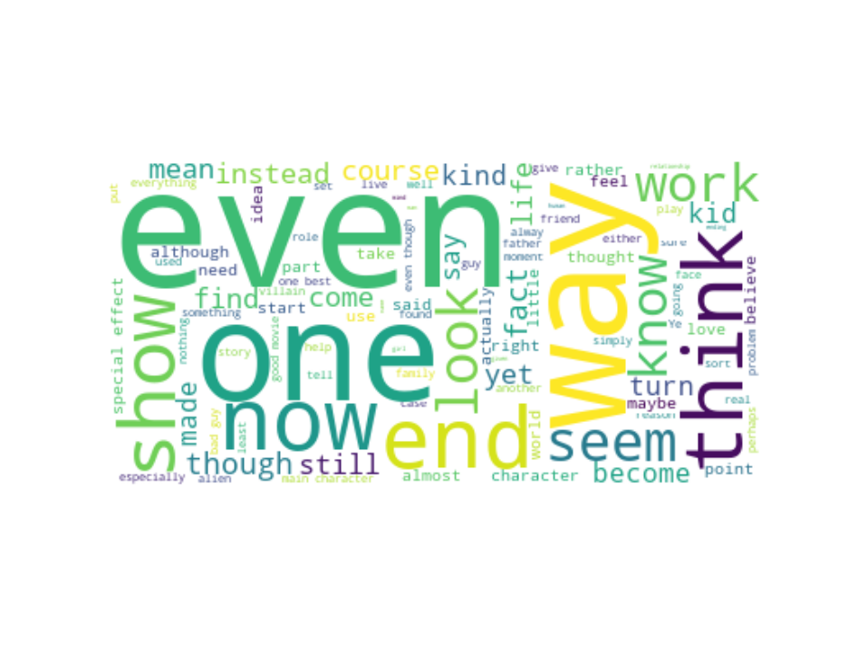

# Movie Spoiler Detection

## Scope
1. Background
2. Problem Statement
3. Executive Summary
4. Intro to Datasets
5. EDA
6. Feature Engineering
7. Modeling
8. File List

## Background
A spoiler is usually defined as a remark or piece of information which reveals important plot elements (for example the ending or a major plot twist), thus 'spoiling' a surprise and robbing the viewer of the suspense and enjoyment of the film.

Around 50% of consumers felt that is it important that their movie are not spoiled, and 30% felt that it is somewhat important, which speaks for the majority.

And it is hard to avoid spoilers on the internet nowadays - even if you are careful, a social media post or recommended article might spoil your plan to watch the movie you have been planning to watch for a long time, or a season finale over the weekend.

## Problem Statement

- To build a classification model with high sensitivity and specificity to detect spoilers in movie reviews.

## Executive Summary
Data analysis and modelling has been trained on IMDB datasets - reviews & movie plots. Naive Bayes (Multinomial) with Count Vectorizer model with Accuracy of 69.80%,  Sensitivity of 49.87% and Specificity of 50.68%  has been achieved.

EDA has shown that most of the spoiler reviews are with ratings of either more than 7 or 1 (lowest), it might be either caused by excited users who wants to share their thoughts on the plot and characters or users who might be disappointed on the plot. This can be further backed-up by vizualizing all common words on word cloud which will be further explained in EDA findings.

Misclassified reviews were looked at after modelling, and some were hard to determine why they were misclassified as what constitutes a spoiler is inherently a subjective assessment.

Recommendations and further analysis:
- Deep learning algorithms like Dependency Parsing will be performed on the model to improve on the accuracy, sensitivity and specificity, as it recognizes a sentence and assigning a syntactic structure to it.
- Dataset might not be comprehensive enough, further research should be done - each sentence with spoiler/ non-spoiler tag.
- Does not understand IMDB's algorithm behind spoiler detection.

## Intro to Datasets
- IMDB_movie_details.json
  - Contains all movie and TV show details (except for movie/TV titles)
- IMDB_reviews
  - User reviews, user ratings etc
- IMDB movies.csv
  - Mainly for abstraction of movie titles

## EDA
The following shows the EDA process:
1. Removed any movies with less than 100 reviews
2. Removed movies with release date of 1990 and earlier
3. Word cloud of all reviews
4. User rating analysis
5. Movie genre analysis

The following shows a summary on the EDA findings:
- Common words appeared in reviews for spoilers and non-spoilers   

  - Spoilers:
    - Many words that expresses their feelings like seem, show, think, know, end, maybe, believe, find etc
    - People wants to express how they felt about the movie and their interpretation of the movie itself   

  - Non-Spoilers
    - Words like complimenting the movie good movie, special effect, sci fi, great movie, action scene, main character etc
    - People who likes the movie are less likely to spoil the movie in their reviews
- Genres with the most number of spoilers:   
    - ['Action', 'Adventure', 'Sci-Fi'] many of them are either DC or Marvel movies

- Most popular Genre is ['Action','Adventure','Sci-Fi']
    - Movies like Batman v Superman: Dawn of Justice, Serenity, Jurassic World and Spider-Man series etc

## Feature Engineering
The following shows the feature engineering process:
1. Combining review_summary with review_text and plot_summary with plot_synopsis
2. Adding in features like cosine similarity between plot and reviews, user_ratings for each review
3. Encoding of movie genres to predict on multiple movies

## Modeling
The following shows the modeling process:
1. Train-Test Split
2. Vectorizing of words for each review
3. Hyperparameter Tuning
4. Cross Validation
5. Test Prediction
6. Model Evaluation

The following shows the models built and the corresponding Accuracy, Precision and Recall (for spoiler reviews) scores used for model evaluation:

|Model |Train Accuracy |Test Accuracy |Precision |Recall |
|:-----|:-----|:-----|:-----|:-----|
|Logistic Regression with Count Vectorizer | 77.92% | 68.98% | 49.23% | 45.98% |
|Logistic Regression with TFIDF Vectorizer | 77.95% | 72.35% | 57.38% | 45.52% |
|Naive Bayes (Multinomial) with Count Vectorizer | 73.38% | 69.80% | 50.68% | 49.87% |
|Naive Bayes (Multinomial) with TFIDF Vectorizer | 72.33% | 71.78% | 73.02% | 21.20% |
|Naive Bayes (Complement) with Count Vectorizer | 71.70% | 67.74% | 47.69% | 55.53% |
|Naive Bayes (Complement) with TDIDF Vectorizer | 71.95% | 67.24% | 47.27% | 53.13% |
|SVM with Count Vectorizer | 86.04% | 71.95% | 56.71% | 35.31% |
|SVM with TFIDF Vectorizer | 99.56% | 70.63% | 54.11% | 26.42% |
|XGBoost with Count Vectorizer | 87.53% | 72.19% | 58.02% | 42.20% |
|XGBoost with TDIDF Vectorizer | 87.53% | 71.45% | 56.41% | 29.65% |   

The Naive Bayes (Multinomial) with Count Vectorizer was selected for final modelling.

## File List

### codes File Descriptions

1. IMDB - Cleaning and EDA
2. IMDB - Modelling for one movie
3. IMDB - Modelling for multiple movies
4. Word2Vec_Doc2Vec

### IMDB File Descriptions
[Please download IMDB_reviews.json & GoogleNews-vectors-negative300.bin here](https://drive.google.com/drive/folders/1BpHmJmTTPTiXl73qcIr4vJCXsmRBGuJZ?usp=sharing)

**IMDB_movie_details.json**    
This file contains metadata about movies/tv shows reviews for which are present in the IMDB_reviews.json file. The following information is present in each record of this file:

|Feature |Description |
|:-----|:-----|
| movie_id | Unique id of the movie/tv-show. |
| plot_summary | Plot summary of the item. Does not contain spoilers. |
| duration | Item runtime duration. |
| genre | Associated genres. |
| rating | Overall rating for the item. |
| release_date | The release date of the item. |
| plot_synopsis | Synopsis of item's plot. Contains spoiler content. |  

**IMDB_reviews.json**  
This file contains user reviews for various items. The following information is present in each record:

|Feature |Description |
|:-----|:-----|
| review_date | Date the review was written. |
| movie_id | Unique id for the item. |
| user_id | Unique id for the review author. |
| is_spoiler | Indication whether review contains a spoiler. |
| review_text | Text review about the item. |   
| rating | Rating given by the user to the item. |
| review_summary | Short summary of the review. |  

**IMDB movies.csv**   
All the movies with more than 100 votes have been scraped as of 17/11/2019.

|Feature |Description |
|:-----|:-----|
| imdb_title_id | Title ID on IMDb |
| title | Title name
| original_title | Original title name |
| year | Year of release |
| date_published | Date of release|
| genre | Movie genre |
| duration | Duration (in minutes) |
| country | Movie country |
| language | Movie language |
| director | Director name |
| writer | Writer name|
| production_company | Production company |
| actors | Actor names |
| description | Plot descrption |
| avg_vote | Average vote |
| votes | Number of votes received |
| budget | Budget |
| usa_gross_income | USA gross income |
| worlwide_gross_income | Worldwide gross income |
| metascore | Metascore rating |
| reviews_from_users | Number of reviews from users |
| reviews_from_critics | Number of reviews from critics |

**df.csv**   
- Final dataset used for modeling  
  - Combination of all features in IMDB_movie_details, IMDB_reviews and IMDB movies (only title remained)

**GoogleNews-vectors-negative300.bin**
- Used for Word2Ved
